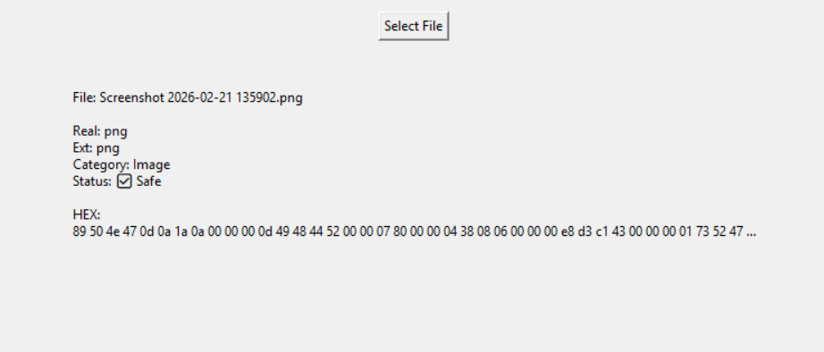
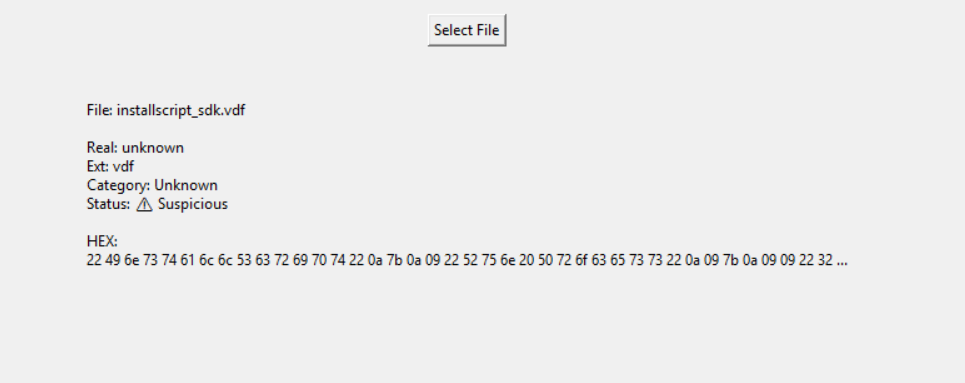

<h1 align="center">🛡️ File Type Detector</h1>

  <b>Detect real file types using magic numbers • Identify fake files • Binary analysis tool</b>

  
  
  

## 🚨 Problem
Attackers often disguise malicious files by changing extensions  
Example: `virus.exe → photo.jpg`

This tricks users into opening harmful files.

## 💡 Solution
This tool reads **file signatures (magic numbers)** from binary data  
and detects the **actual file type**, ignoring fake extensions.

## 🎯 Impact
- Detect suspicious files ⚠️  
- Understand binary file structure 🧠  
- Useful in malware analysis 💥  

## ⚡ Features
✔ Detect real file type  
✔ Identify fake extensions  
✔ File category detection (Image, Executable, etc.)  
✔ HEX view (binary data)  
✔ CLI scanner (single file + folder)  

## 🧪 Example Output

sample.jpg
Real: exe | Ext: jpg | Category: Executable | ⚠️ Suspicious

HEX:
4d 5a 90 00 03 00 00 00 ...

---

## 📸 Demo

---

## 📂 Project Structure
file-type-detector/
│
├── main.py
├── detector.py
├── signatures.py
├── test_files/

## 🚀 How to Run

### 1️⃣ Clone repository
git clone https://github.com/GREYHATTER225/file-type-detector.git

### 2️⃣ Navigate into folder

cd file-type-detector

### 3️⃣ Run the tool

python main.py

## 🧠 Concepts Used
- Magic Numbers (File Signatures)
- Binary Analysis
- Malware Detection Basics
- File Structure Understanding
